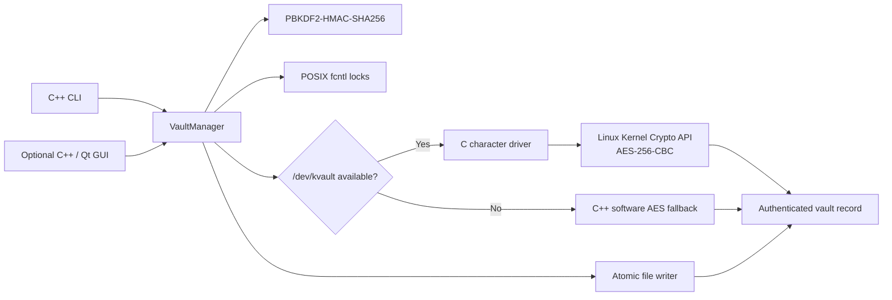

# KernelVault

[](https://github.com/sky-ruler/KernelVault/actions/workflows/build_and_test.yml)
[](https://github.com/sky-ruler/KernelVault/actions/workflows/codeql.yml)
[](docs/TESTING.md)
[](CMakeLists.txt)
[](driver/)
[](LICENSE)
[](packaging/)

KernelVault is an enterprise-grade Linux kernel-assisted secure storage subsystem. It pairs a high-assurance C++20 user-space runtime with a dedicated Linux character device driver (`/dev/kvault`) bridging to the Linux Kernel Crypto API for hardware-accelerated AES-256-CBC transformations. Features dual-key derivation (RFC 2898 PBKDF2), streaming $O(1)$ RAM integrity verification (HMAC-SHA256), POSIX metadata preservation, anti-forensic file shredding, recursive directory archiving, empirical hardware benchmarking, and a modern Qt6 desktop GUI.

> **Notice:** This project has not received an independent security audit and is not intended to protect production or high-value data.

## Project scope

| Feature | Implementation in this repository |
| --- | --- |
| C/C++ implementation | C++20 vault engine, CLI, and optional Qt GUI in `src/` and `include/`; C Linux driver in `driver/`. |
| Linux operating system | CMake rejects non-Linux builds. The driver uses Linux character-device, IOCTL, and Kernel Crypto API interfaces. |
| Device-driver concepts | Dynamic character-device registration, exclusive open gate, mutex-protected state, `copy_from_user` / `copy_to_user`, IOCTL controls, and key cleanup. |
| Software architecture | CLI and GUI share vault orchestration, key derivation, advisory locking, atomic file writer, and kernel-driver boundary documented in [`docs/ARCHITECTURE.md`](docs/ARCHITECTURE.md). |
| Build and instructions | C/C++ source, build configuration, tests, license, and run instructions are maintained in this repository. |

KernelVault can be operated from a Linux terminal or a native Linux desktop window. Its implementation is C and C++; the optional GUI uses Qt Widgets. There is no browser-based application. CMake, Make/Kbuild, GitHub Actions, and Markdown are build, CI, and documentation artifacts.

## How it works



The driver performs cipher transformations. The C++ application derives keys and authenticates vault records with HMAC-SHA256. The driver is optional: if it is absent or inaccessible, the user-space software cipher fallback is used. The fallback and driver implement the same record-level encryption workflow; records are authenticated before plaintext output is committed. Both the CLI and GUI call the same `VaultManager` implementation.

## Requirements

- Linux (supported project target); Windows users can use Ubuntu on WSL2 for the CLI and WSLg for the GUI
- CMake 3.20 or newer
- GCC 11+ or Clang 14+ with C++20 support
- GNU Make
- GoogleTest to build and run the test suite
- Qt 6.2 or newer (`qt6-base-dev`) to build the optional desktop GUI
- Matching Linux kernel headers only when building the optional driver module

> [!TIP]
> **First time using KernelVault?** Read the **[Beginner's Step-by-Step Guide & Tutorial](docs/GETTING_STARTED.md)** for a zero-to-hero walkthrough with plain-English diagrams, 6 practical tutorials, and solutions to common beginner gotchas!

## Quick start (Linux or Ubuntu on WSL2)

On Windows, if WSL2 is not installed yet, run this once from PowerShell as Administrator:

```powershell
wsl --install -d Ubuntu
```

Complete Ubuntu's first-run account setup. Then run the following commands in the **Ubuntu terminal** (not PowerShell). Clone into the Linux home directory. In WSL, building a checkout and build directory under `/mnt/c` can cause CMake `Operation not permitted` errors; keeping the checkout under `$HOME` avoids the Windows-mounted filesystem boundary.

```bash
sudo apt update
sudo apt install -y git build-essential cmake libgtest-dev qt6-base-dev
git clone <repository-url>
cd KernelVault
cmake -S . -B build -DCMAKE_BUILD_TYPE=Release -DBUILD_TESTING=ON -DBUILD_GUI=ON
cmake --build build --parallel
ctest --test-dir build --output-on-failure
./build/kvault --help
./build/kvault-gui
```

The CLI is `build/kvault`; the desktop app is `build/kvault-gui`. The GUI uses Qt Widgets and shares the same C++ vault engine as the CLI. To build only the CLI and avoid the Qt dependency, omit `qt6-base-dev` and use `-DBUILD_GUI=OFF`. The test suite uses the system GoogleTest installed by `libgtest-dev`; if CMake cannot find it, CMake's FetchContent fallback requires network access.

WSL supports building and running the CLI and, with WSLg, the Qt desktop app. Both use the user-space cipher when `/dev/kvault` is unavailable. Loading and demonstrating the kernel module requires a suitable Linux kernel; use a disposable Ubuntu VM or Linux machine for that part. WSL may not provide matching module headers or permit loading this out-of-tree driver.

### Build from an existing Windows checkout in WSL

If the source is already under `/mnt/c`, keep CMake's build output in WSL's Linux filesystem:

```bash
cmake -S "/mnt/c/Projects/KernelVault" -B "$HOME/kvault-build" \
  -DCMAKE_BUILD_TYPE=Release -DBUILD_TESTING=ON -DBUILD_GUI=ON
cmake --build "$HOME/kvault-build" --parallel
ctest --test-dir "$HOME/kvault-build" --output-on-failure
"$HOME/kvault-build/kvault" --help
"$HOME/kvault-build/kvault-gui"
```

For a normal Linux checkout, the same configure/build/test commands work with `-S . -B build`.

### Build the optional kernel driver

On a Linux VM or machine with headers for its running kernel, install the driver build tools and matching headers:

```bash
sudo apt install -y kmod linux-headers-$(uname -r)
```

Then build the module separately:

```bash
make -C driver
```

Or use the CMake target:

```bash
cmake --build build --target driver
```

The module build uses the headers for the running kernel by default. To select another installed kernel build tree:

```bash
make -C driver KDIR=/path/to/kernel/build
```

## Run the CLI

The following self-contained round-trip creates temporary input, encrypts it, decrypts it, and stops with an error if the restored file differs:

```bash
set -eu
TEST_DIR="$(mktemp -d /tmp/kvault-test.XXXXXX)"
printf 'KernelVault sample data\n' > "$TEST_DIR/example.txt"
./build/kvault init --vault "$TEST_DIR/vault"
./build/kvault encrypt --vault "$TEST_DIR/vault" --in "$TEST_DIR"/*.txt --key 'sample-passphrase'
./build/kvault list --vault "$TEST_DIR/vault"
./build/kvault verify --vault "$TEST_DIR/vault" --all --key 'sample-passphrase'
./build/kvault decrypt --vault "$TEST_DIR/vault" --all --out-dir "$TEST_DIR/restored" --key 'sample-passphrase'
cmp "$TEST_DIR/example.txt" "$TEST_DIR/restored/example.txt"
echo 'Round trip verified: source and restored files match.'
./build/kvault status --vault "$TEST_DIR/vault"
```

The encrypted record is stored at `$TEST_DIR/vault/records/example.txt.enc`.

### Utility & Production CLI Capabilities
- **Batch & Wildcard Operations:** Encrypt or decrypt multiple files simultaneously (`kvault encrypt --in *.pdf --vault myvault`) using a single passphrase prompt.
- **Directory Hierarchy Archiving:** Pack and encrypt recursive folder trees (`kvault encrypt --dir /path/to/folder --vault myvault`) preserving directory depth, subfolders, and relative paths.
- **Cryptographic Audit In-Place:** Perform HMAC integrity verification without writing plaintext to disk (`kvault verify --all --vault myvault`).
- **Tabular Record Inventory:** List stored vault records with plaintext sizes, stored sizes, POSIX permissions, modification timestamps, and advisory lock statuses (`kvault list --vault myvault`).
- **Safe Record Deletion:** Remove records safely under exclusive advisory mutex (`kvault rm --file example.txt --vault myvault`).
- **Multi-Pass Source Shredding:** Securely wipe plaintext source files (`--shred` / `--wipe`) with CSPRNG entropy (`getrandom`), zeroization, and `fsync()` before unlinking.
- **Empirical Performance Benchmarking:** Measure real hardware throughput and PBKDF2 iteration speed across streaming workloads (`kvault bench --size-mb 16`).

### Empirical Performance Benchmarks

Measured on Linux (x86_64, GCC 15.2.0, 64 KiB streaming chunks):

| Cryptographic Operation | Workload / Details | Latency / Time | Measured Throughput | Engine / Backend |
| :--- | :--- | :--- | :--- | :--- |
| **PBKDF2-HMAC-SHA256** | 100,000 rounds (dual 256-bit keys) | ~1.40 s | **~71,000 iter/s** | User-space (RFC 2898) |
| **AES-256-CBC Encryption** | 8 MiB (64 KiB chunks) | ~0.67 s | **12.52 MB/s** | Software (C++20 Portable) |
| **AES-256-CBC Decryption** | 8 MiB (64 KiB chunks) | ~6.79 s | **1.23 MB/s** | Software (C++20 Portable) |
| **HMAC-SHA256 Streaming** | 8 MiB continuous digest | ~0.16 s | **50.70 MB/s** | User-space (Streaming $O(1)$ RAM) |
| **Full Pipeline (Enc + MAC)** | 8 MiB streaming pipeline | ~0.86 s | **9.69 MB/s** | Software + HMAC Streaming |

*(When `/dev/kvault` Linux driver is active, encryption and decryption are accelerated by in-kernel crypto hardware engines).*

## Run the desktop GUI

On a Linux desktop or Ubuntu under WSLg, start the native interface with:

```bash
./build/kvault-gui
```

Choose a vault folder and initialize it. The modernized interface provides three functional tabs:
1. **Encrypt Files / Folders:** Multi-file selector, directory selector, source shred toggle, and passphrase entry.
2. **Decrypt Record:** Record dropdown, output destination chooser, and authenticated restoration.
3. **Vault Inventory & Audit:** Real-time table view of stored records (sizes, versions, permissions, timestamps, lock states), with interactive buttons to **Verify Integrity (HMAC)**, **Audit All Records**, and safely **Delete Record**.

> **Passphrase handling:** The CLI supports interactive masked input (with terminal echo disabled via POSIX `termios`), pipeline streaming (`--key-stdin`), the `KVAULT_KEY` environment variable, or explicit command-line flags (`--key`). When `--key` is passed via `argv`, process memory is immediately scrubbed in-place to prevent inspection via `ps aux` or `/proc/<pid>/cmdline`. The GUI masks typed passphrases and securely wipes memory upon completion.

---

## Architectural Comparison Matrix

| Feature / Architectural Quality | KernelVault v3 | GnuPG (GPG) | OpenSSL CLI Scripts | Linux LUKS / dm-crypt |
| :--- | :---: | :---: | :---: | :---: |
| **Isolation Model** | **Application Per-Record** | Application Per-Record | Application Per-File | Whole Block Device |
| **Kernel Hardware Acceleration** | **Native Character Driver (`/dev/kvault`)** | User-Space Only | User-Space Only | Native In-Kernel |
| **Subprocess Execution (`execve`)** | **Zero (Native C++20 / C)** | Daemon / Subprocess | Shell / Subprocess Spawning | Zero (Kernel Module) |
| **Crash Consistency & Durability** | **Atomic `renameat2` + Directory `fsync`** | Temporary File Swap | In-Place Overwrite (Corruptible) | Block-Level Journaling |
| **Memory Pinning & Swap Prevention** | **`mlock(2)` + `MADV_DONTDUMP`** | Secure Memory Allocator | Unpinned Userland Heap | Kernel Unswappable Pages |
| **Dead-Store Elimination Defense** | **`secureZero` Volatile Barrier + `memzero_explicit`** | Custom Scrubber | Generic `OPENSSL_cleanse` | Kernel `memzero_explicit` |
| **Anti-Forensic File Shredding** | **Built-in CSPRNG Multi-Pass (`--shred`)** | Requires external `shred` | Requires external `shred` | Block Discard / Trim |
| **Directory Hierarchy Archiving** | **Native `KVDIR1` (Zip-Slip Immune)** | Spawns external `tar` | Spawns external `tar` | Filesystem-level |
| **Multi-Process Concurrency** | **Non-blocking POSIX `fcntl(F_SETLK)`** | Lockfile heuristics | None (Race conditions) | Kernel-level locking |

---

## Complete Enterprise Documentation Library

| Document | Purpose & Core Content | Target Audience |
| :--- | :--- | :--- |
| **[`docs/GETTING_STARTED.md`](docs/GETTING_STARTED.md)** | Step-by-step tutorial from scratch, core concepts in plain English, 6 guided walk-throughs, and beginner gotchas. | Newcomers, Students, Evaluators |
| **[`docs/ARCHITECTURE.md`](docs/ARCHITECTURE.md)** | Deep systems diagrams, 96-byte wire layout, `KVDIR1` binary specification, driver session state machine, memory pinning lifecycle, and ACID durability model. | Systems Architects, Core Developers |
| **[`docs/DESIGN_DECISIONS.md`](docs/DESIGN_DECISIONS.md)** | Engineering rationale, ADR index (ADR-001 to ADR-007), component-by-component real-world industrial precedents, and beginner vs enterprise comparisons. | Senior Reviewers, Evaluators |
| **[`docs/THREAT_MODEL.md`](docs/THREAT_MODEL.md)** | Formal STRIDE security analysis, asset classification, trust boundary architecture, and concrete mitigations for CBC bit-flipping, zip-slip, and swap leakage. | Security Auditors, Cryptographers |
| **[`docs/FAQ.md`](docs/FAQ.md)** | Definitive technical FAQ answering "Why this, Why not that?", architectural objections, kernel boundary questions, and failure mode behaviors. | Technical Leads, Evaluators |
| **[`docs/RUNBOOK.md`](docs/RUNBOOK.md)** | Production operator manual covering initialization, batch encryption, secure shredding, in-place HMAC audits, driver lifecycle, and udev policies. | DevOps, SysAdmins, Operators |
| **[`docs/TESTING.md`](docs/TESTING.md)** | Verification methodology covering all 34 automated unit, integration, sanitizer (ASan/UBSan), and coverage-guided fuzz testing suites. | QA Engineers, Test Automators |
| **[`docs/INTERVIEW_CHEAT_SHEET.md`](docs/INTERVIEW_CHEAT_SHEET.md)** | Master technical defense guide deconstructing wrapper objections, GCM nonce-reuse traps, and low-level Linux systems contracts. | Job Candidates, Evaluators |
| **[`SECURITY.md`](SECURITY.md)** | Coordinated Vulnerability Disclosure (CVD) policy, supported versions matrix, 48-hour response SLA, and confidential reporting channels. | Security Researchers |
| **[`CONTRIBUTING.md`](CONTRIBUTING.md)** | Development workflow, C++20 invariants, zero-warning compilation barrier (`-Werror`), Conventional Commits, and PR checklist. | Open-Source Contributors |
| **[`CHANGELOG.md`](CHANGELOG.md)** | Semantic Versioning release notes adhering strictly to the Keep a Changelog standard. | Integrators, Users |

## Record format

Version 3 records contain a packed 96-byte header followed by AES-CBC ciphertext. Version 3 derives distinct keys for encryption ($K_{\text{enc}}$) and authentication ($K_{\text{mac}}$) via RFC 2898 multi-block PBKDF2 and serializes all integer fields in canonical Little-Endian wire format. The HMAC-SHA256 covers the header with its tag field set to zero, followed by the ciphertext. The reader retains backward compatibility with version 2 and version 1 records.

| Offset | Size | Field | Purpose |
| ---: | ---: | --- | --- |
| `0x00` | 4 bytes | Magic | Identifies a KernelVault record (`KVLT` = `0x4B564C54`). |
| `0x04` | 4 bytes | Version | Current writer version is `3` (Canonical LE + Dual Keys). |
| `0x08` | 16 bytes | Salt | Per-record PBKDF2 salt. |
| `0x18` | 16 bytes | IV | AES-CBC initialization vector. |
| `0x28` | 8 bytes | Original size | Plaintext length before padding (Little-Endian). |
| `0x30` | 8 bytes | Payload size | Ciphertext length in bytes (Little-Endian). |
| `0x38` | 32 bytes | HMAC | Record authentication tag ($K_{\text{mac}}$). |
| `0x58` | 4 bytes | POSIX Mode | POSIX permission bits (`st_mode & 07777`, Little-Endian). |
| `0x5C` | 4 bytes | Modified Epoch | Modification timestamp (seconds since Unix epoch, Little-Endian). |
| `0x60` | Variable | Ciphertext | AES-256-CBC encrypted payload ($K_{\text{enc}}$). |

All multi-byte header integers are encoded in Little-Endian wire format for deterministic cross-architecture compatibility.

## Driver workflow

Build and load the module on a Linux test machine or VM with matching headers:

```bash
make -C driver
sudo insmod driver/kvault.ko
ls -l /dev/kvault
sudo dmesg | tail -n 20
```

Then run the CLI as a user permitted to open `/dev/kvault`. Device-node permissions are controlled by the host's device-management policy. Do not make the node world-writable. Unload the module after testing:

```bash
sudo rmmod kvault
```

Kernel modules run with kernel privileges. Use a disposable Linux VM for driver testing and review the source before loading it.

## Tests and CI

Build and run the C++ test suite:

```bash
cmake -S . -B build -DCMAKE_BUILD_TYPE=Debug -DBUILD_TESTING=ON
cmake --build build --parallel
ctest --test-dir build --output-on-failure
```

The current GoogleTest suite covers file-descriptor ownership, POSIX locking, atomic file writes, and vault-level encryption/decryption and integrity behavior. It does **not** automate loading or exercising the kernel module; driver validation requires a Linux environment with suitable headers and privileges. See [`docs/TESTING.md`](docs/TESTING.md) for the validation scope.

GitHub Actions builds and tests the user-space project with GCC and Clang and compiles the driver against installed Linux headers.

## Repository layout

```text
.
├── .github/workflows/       GitHub Actions build and test workflow
├── driver/                  C Linux character-device driver and Kbuild files
├── include/                 C++ interfaces and shared driver IOCTL definitions
├── src/                     C++20 CLI, optional Qt GUI, vault engine, and POSIX components
├── tests/                   GoogleTest C++ test suite
├── docs/                    Architecture, runbook, and design decisions
├── CMakeLists.txt           Linux-only CMake build
├── LICENSE                  MIT OR GPL-2.0 dual license
└── README.md                Project overview and documentation
```

## License

KernelVault is dual-licensed under the MIT License or GNU General Public License version 2. See [`LICENSE`](LICENSE).
