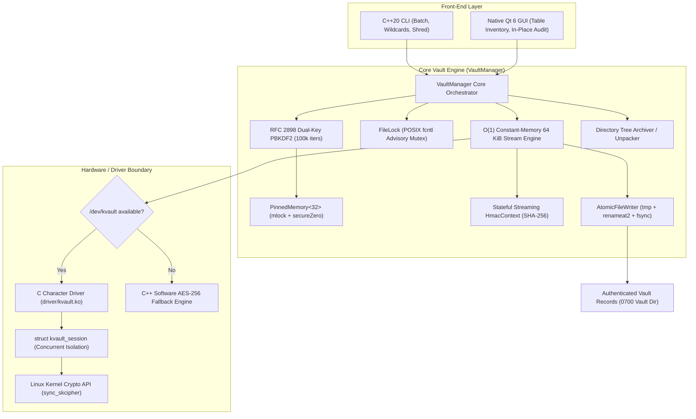
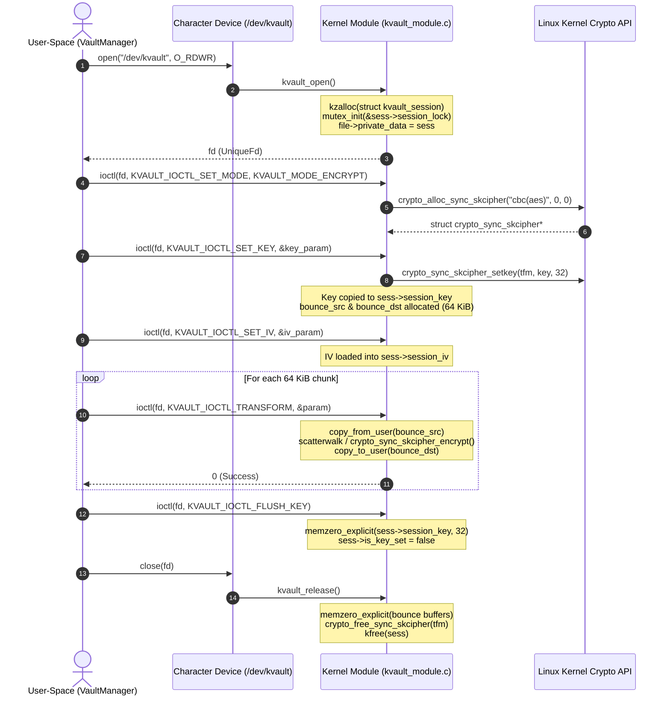
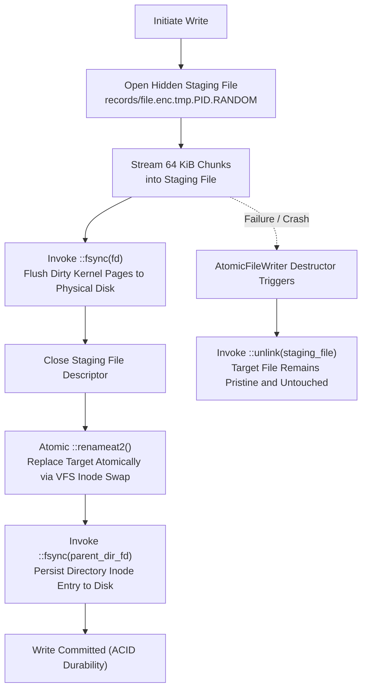

# Architecture

KernelVault is split across a high-performance Linux user-space application and a Linux character-device driver. Users can operate the shared C++ vault engine through the command-line interface or an optional native Qt 6 desktop interface. The application owns vault policy, key derivation, authenticated record streaming, POSIX metadata preservation, advisory locking, and crash-consistent atomic file persistence. The driver exposes a typed IOCTL boundary for cipher transformations through the Linux Kernel Crypto API.

## Main Flow



## System Components

| Component | Responsibility |
| :--- | :--- |
| `src/main.cpp` | Parses `init`, `encrypt` (multi-file, wildcards, `--dir`, `--shred`), `decrypt` (single, batch, `--all`), `list` (tabular inventory), `rm` (safe deletion), `verify` (in-place HMAC audit), and `status`. Scrubs `argv` memory immediately to hide credentials from `/proc/<pid>/cmdline`. |
| `src/gui_main.cpp` | Native Qt 6 GUI providing 3 functional tabs: (1) Encrypt Files & Folders (multi-file, directory tree, shred toggle), (2) Decrypt Record, and (3) Vault Inventory & Audit (`QTableWidget` with in-place HMAC verification and safe deletion). All cryptographic tasks run on worker threads away from the UI thread. |
| `src/VaultManager.cpp` | Core orchestrator for streaming encryption, 2-pass authenticated decryption, in-place verification, directory hierarchy archiving, secure multi-pass file shredding, POSIX metadata preservation, and advisory lock lifecycle management. |
| `src/KeyDerivation.cpp` | Implements RFC 2898 multi-block PBKDF2-HMAC-SHA256, deriving independent 256-bit encryption ($K_{\text{enc}}$) and authentication ($K_{\text{mac}}$) keys. Provides stateful `HmacContext`, CSPRNG salt/IV generation (`getrandom`), and anti-optimization memory clearing (`secureZero`). |
| `include/PinnedMemory.hpp` | Header-only RAII memory manager calling `::mlock()` on allocation to pin keys in physical RAM (preventing swap leaks) and `secureZero()` on release. |
| `src/FileLock.cpp` | Enforces POSIX advisory locking via `fcntl(2)` record locks (`F_WRLCK` exclusive, `F_RDLCK` shared) to coordinate multi-process and multi-thread vault access. |
| `src/AtomicFileWriter.cpp` | Provides crash consistency (ACID durability) by writing to hidden temporary files on the same filesystem mount, calling `fsync()`, executing atomic `renameat2()`, and synchronizing the parent directory. |
| `src/UniqueFd.cpp` | Move-only RAII container for Linux file descriptors, preventing resource and descriptor leaks. |
| `driver/kvault_module.c` | Linux character-device driver registering `/dev/kvault` with dynamic major allocation. Implements per-session isolated state (`struct kvault_session`) in `file->private_data` with pre-allocated 64 KiB zero-churn IO buffers, submitting AES-256-CBC requests to the Linux Kernel Crypto API. |
| `include/kvault_ioctl.h` | Shared user/kernel ABI defining typed IOCTL commands (`KVAULT_IOCTL_SET_KEY`, `KVAULT_IOCTL_TRANSFORM`, `KVAULT_IOCTL_GET_STATUS`). |

## Cryptographic Protocol & Streaming Pipeline

### 1. Dual-Key Derivation (RFC 2898 Multi-Block PBKDF2)
A single user passphrase ($P$) is expanded with a 128-bit cryptographically secure salt ($S$) over 100,000 iterations of HMAC-SHA256 into two independent 256-bit keys:
$$K_{\text{enc}} = \text{PBKDF2}(P, S, 100000, \text{Block } 1)$$
$$K_{\text{mac}} = \text{PBKDF2}(P, S, 100000, \text{Block } 2)$$
This guarantees $K_{\text{enc}} \neq K_{\text{mac}}$, complying with NIST SP 800-108 key separation standards.

### 2. Encryption Pipeline ($O(1)$ RAM)
1. **Metadata Ingestion:** Source file permissions (`st_mode & 07777`) and modification timestamps (`st_mtime`) are captured and encoded in the 96-byte header in Little-Endian format.
2. **Lock Acquisition:** An exclusive POSIX advisory lock (`F_WRLCK`) is acquired on `$VAULT/locks/<record>.lock`.
3. **Atomic Writer Initialization:** An unlinked temporary file is opened on the destination filesystem.
4. **Header Ingestion:** The 96-byte header (with HMAC tag field zeroed) is ingested into a streaming `HmacContext`.
5. **Streaming Chunk Transformation:** Plaintext is read in 64 KiB chunks, padded via PKCS#7 on the final block, encrypted via `/dev/kvault` (or software fallback), written to disk, and simultaneously fed into `HmacContext`.
6. **Tag Finalization & Commit:** The finalized 32-byte HMAC tag is written to the header, buffers are flushed to disk via `fsync()`, and the file is atomically committed via `renameat2()`.
7. **Anti-Forensic Shredding (Optional):** If `--shred` is specified, the source file is overwritten with CSPRNG entropy (`getrandom`), overwritten with zeroes, flushed with `fsync()`, and unlinked.

### 3. Decryption & Verification Pipeline (2-Pass Security)
1. **Lock Acquisition:** A shared POSIX advisory lock (`F_RDLCK`) is acquired.
2. **Header Validation:** Magic (`KVLT`), version (V3/V2/V1), payload bounds, and integer lengths are validated.
3. **Pass 1 (Streaming Authentication):** The header and entire ciphertext stream are ingested into `HmacContext` in 64 KiB chunks and verified against the stored tag using constant-time comparison. If authentication fails, the process aborts immediately. **Zero plaintext is written to disk or decrypted.**
4. **Pass 2 (Decryption Stream):** Ciphertext chunks are read, transformed via the cipher engine, validated for PKCS#7 padding on the final chunk, and written through `AtomicFileWriter`.
5. **Metadata Restoration:** On atomic commit, POSIX permissions are restored via `::chmod()` and original timestamps are restored via `::utimensat()`.

## Kernel Driver Boundary

The driver registers `/dev/kvault` and provides concurrent per-session isolation:
- **Per-Open Session Allocation:** Every `open("/dev/kvault")` allocates a dedicated `struct kvault_session` stored in `file->private_data`. Multiple threads or processes can encrypt simultaneously without global mutex contention.
- **Zero-Churn Pre-Allocated IO Buffers:** Each session allocates 64 KiB input and output bounce buffers at initialization (`KVAULT_IOCTL_SET_KEY`). These buffers are reused across all subsequent chunk transforms, eliminating kernel slab memory fragmentation.
- **Hardware Acceleration:** Binds to `crypto_alloc_sync_skcipher("cbc(aes)", 0, 0)`, automatically selecting hardware-accelerated CPU instructions (AES-NI, ARM Cryptography Extensions) when present.
- **Memory Hygiene:** On `kvault_release()`, all session key, IV, and data buffers are scrubbed using `memzero_explicit()` before being freed.

## Canonical 96-Byte Record Format

Version 3 records consist of a packed 96-byte header followed by AES-256-CBC ciphertext:

| Offset | Size | Field | Description |
| ---: | ---: | --- | --- |
| `0x00` | 4 bytes | Magic | Magic constant `0x4B564C54` (`KVLT`). |
| `0x04` | 4 bytes | Version | Format version (`0x00000003` for current V3). |
| `0x08` | 16 bytes | Salt | 128-bit CSPRNG salt for PBKDF2 derivation. |
| `0x18` | 16 bytes | IV | 128-bit AES-256-CBC initialization vector. |
| `0x28` | 8 bytes | Original size | Unpadded plaintext size in bytes (Little-Endian). |
| `0x30` | 8 bytes | Payload size | Total ciphertext size including padding (Little-Endian). |
| `0x38` | 32 bytes | HMAC | SHA-256 HMAC tag over header + ciphertext ($K_{\text{mac}}$). |
| `0x58` | 4 bytes | POSIX Mode | Permission bits (`st_mode & 07777`, Little-Endian). |
| `0x5C` | 4 bytes | Modified Epoch | Modification timestamp (seconds since Unix epoch, Little-Endian). |
| `0x60` | Variable | Ciphertext | AES-256-CBC encrypted streaming payload ($K_{\text{enc}}$). |

### Wire Layout Representation

```text
 0                   1                   2                   3
 0 1 2 3 4 5 6 7 8 9 0 1 2 3 4 5 6 7 8 9 0 1 2 3 4 5 6 7 8 9 0 1
+-+-+-+-+-+-+-+-+-+-+-+-+-+-+-+-+-+-+-+-+-+-+-+-+-+-+-+-+-+-+-+-+
|                      Magic (0x4B564C54)                       |  0x00
+-+-+-+-+-+-+-+-+-+-+-+-+-+-+-+-+-+-+-+-+-+-+-+-+-+-+-+-+-+-+-+-+
|                   Version (0x00000003)                        |  0x04
+-+-+-+-+-+-+-+-+-+-+-+-+-+-+-+-+-+-+-+-+-+-+-+-+-+-+-+-+-+-+-+-+
|                                                               |  0x08
+                      Salt (16 Bytes)                          +
|                                                               |  0x14
+-+-+-+-+-+-+-+-+-+-+-+-+-+-+-+-+-+-+-+-+-+-+-+-+-+-+-+-+-+-+-+-+
|                                                               |  0x18
+              Initialization Vector (16 Bytes)                 +
|                                                               |  0x24
+-+-+-+-+-+-+-+-+-+-+-+-+-+-+-+-+-+-+-+-+-+-+-+-+-+-+-+-+-+-+-+-+
|                  Original Plaintext Size (Low)                |  0x28
+-+-+-+-+-+-+-+-+-+-+-+-+-+-+-+-+-+-+-+-+-+-+-+-+-+-+-+-+-+-+-+-+
|                  Original Plaintext Size (High)               |  0x2C
+-+-+-+-+-+-+-+-+-+-+-+-+-+-+-+-+-+-+-+-+-+-+-+-+-+-+-+-+-+-+-+-+
|                  Ciphertext Payload Size (Low)                |  0x30
+-+-+-+-+-+-+-+-+-+-+-+-+-+-+-+-+-+-+-+-+-+-+-+-+-+-+-+-+-+-+-+-+
|                  Ciphertext Payload Size (High)               |  0x34
+-+-+-+-+-+-+-+-+-+-+-+-+-+-+-+-+-+-+-+-+-+-+-+-+-+-+-+-+-+-+-+-+
|                                                               |  0x38
+                   HMAC-SHA256 Authentication                  +
+                       Tag (32 Bytes)                          +
|                                                               |  0x54
+-+-+-+-+-+-+-+-+-+-+-+-+-+-+-+-+-+-+-+-+-+-+-+-+-+-+-+-+-+-+-+-+
|               POSIX File Mode (st_mode & 07777)               |  0x58
+-+-+-+-+-+-+-+-+-+-+-+-+-+-+-+-+-+-+-+-+-+-+-+-+-+-+-+-+-+-+-+-+
|           Modification Timestamp (Epoch Seconds)              |  0x5C
+-+-+-+-+-+-+-+-+-+-+-+-+-+-+-+-+-+-+-+-+-+-+-+-+-+-+-+-+-+-+-+-+
|                     Ciphertext Data Stream ...                |  0x60
```

## Directory Archiving Engine (`KVDIR1` Format)

KernelVault packs directory trees natively without spawning `tar` or `zip` subprocesses, eliminating shell injection hazards and zero-day compression library vulnerabilities:

```text
+---------------------------------------------------------------+
|  KVDIR1 Magic (8 Bytes): "KVDIR01\n"                          |
+---------------------------------------------------------------+
|  Total Directory Entries (uint64_t Little-Endian)             |
+---------------------------------------------------------------+
|  Entry #1 Header:                                             |
|    - Path Length (uint32_t LE)                                |
|    - Relative Path (UTF-8 bytes, e.g. "subdir/config.json")   |
|    - Entry Type: 0x01 = Regular File, 0x02 = Directory        |
|    - POSIX Mode (uint32_t LE)                                 |
|    - Modification Epoch (uint32_t LE)                         |
|    - Payload Size (uint64_t LE, 0 if directory)               |
|  Entry #1 Payload Bytes ...                                   |
+---------------------------------------------------------------+
|  Entry #2 Header ...                                          |
|  Entry #2 Payload Bytes ...                                   |
+---------------------------------------------------------------+
```

### Path Traversal Defense
When unpacking `KVDIR1` archives, `decryptDirectory()` validates every entry path:
1. Rejects any path starting with `/` or `\\` (prevents absolute path overwrites).
2. Rejects any path containing `..` (prevents directory escapes).
3. Rejects empty path tokens.
4. Normalizes destination path via `std::filesystem::path::lexically_normal()` and verifies that it resides strictly inside the user's chosen output directory.

## Memory Pinning & Zeroization Lifecycle

```mermaid
stateDiagram-v2
    [*] --> Allocation: PinnedMemory<N>() Constructor
    Allocation --> MemoryLock: ::mlock(buffer, N)
    MemoryLock --> AntiDump: ::madvise(buffer, N, MADV_DONTDUMP)
    AntiDump --> ActiveUse: Key Derivation / Transformation
    ActiveUse --> VolatileZero: secureZero() / memzero_explicit()
    VolatileZero --> MemoryBarrier: asm volatile("" : : "r"(p) : "memory")
    MemoryBarrier --> MemoryUnlock: ::munlock(buffer, N)
    MemoryUnlock --> Destruction: Buffer Deallocated
    Destruction --> [*]
```

## Linux Kernel Driver Session State Machine



## AtomicFileWriter ACID Crash Consistency


