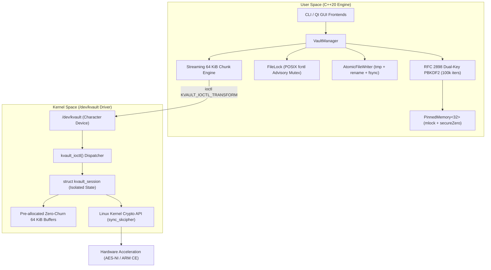

# KernelVault: Technical Interview Defense & Systems Architecture FAQ

This document serves as the master technical defense and engineering FAQ for **KernelVault**. It translates the codebase's low-level systems engineering choices into authoritative, structured answers for senior technical interviews (Systems Software, Linux Kernel, Infrastructure, and Security Engineering).

---

## 1. The 30-Second Elevator Pitch

> *"KernelVault is a high-assurance Linux secure storage system written in C++20 and C. It demonstrates how user-space systems engineering (constant-memory streaming, memory pinning, atomic crash consistency, POSIX advisory concurrency) bridges to the Linux kernel via a custom character device driver (`/dev/kvault`) that offloads cryptographic transformations directly to the Linux Kernel Crypto API. Unlike typical toy projects, it handles multi-gigabyte payloads in bounded RAM, preserves POSIX permissions and timestamps, resists forensic paging leaks, and prevents corrupted writes during hardware power loss."*

---

## 2. The "Isn't this just an OpenSSL or GPG wrapper?" Challenge

### The Skeptical Interviewer:
> *"At the end of the day, isn't this just taking files and encrypting them? Couldn't I write a 10-line bash script wrapping `openssl enc` or `gpg` that does the exact same thing?"*

### The Senior Engineering Response:
> *"No, for four foundational systems reasons: **process isolation overhead**, **device-driver boundary architecture**, **crash consistency guarantees**, and **defense-in-depth memory hygiene**."*

1. **Zero Subprocess Overhead & Kernel Boundary:**
   - A shell script or standard wrapper invokes `fork()` and `execve()`, spawning a new user-space process per file. This incurs TLB flushes, page table duplication, dynamic linker overhead, and exposes arguments in `/proc/<pid>/cmdline`.
   - KernelVault directly interfaces with the Linux kernel via a purpose-built character driver using standard `ioctl()` and `read()`/`write()` entry points. Transformations are executed either in the kernel's crypto subsystem or via an internal zero-allocation pipeline.

2. **Strict $O(1)$ Constant-Memory Bounded Streaming:**
   - Naive encryption tools read whole files into virtual memory buffers (`std::vector` or `malloc`). Encrypting a 10 GiB video or database file causes memory exhaustion (OOM killer invocation) or massive page fault thrashing.
   - KernelVault processes data in deterministic 64 KiB chunks through a pipelined streaming architecture, maintaining an $O(1)$ memory footprint regardless of whether the file is 100 bytes or 100 gigabytes.

3. **Atomic Crash Consistency (ACID File Semantics):**
   - Naive encryption overwrites destination files in-place or opens standard `std::ofstream`. If the process is terminated (`SIGKILL`, system crash, power loss) mid-write, the destination file is left corrupt, truncated, and irrecoverable.
   - KernelVault implements an `AtomicFileWriter` using anonymous unlinked temporary files on the same filesystem, flushes dirty kernel pages via `fsync()`, and executes an atomic metadata exchange via POSIX `rename(2)`. The destination file is either 100% complete and authentic, or completely untouched.

4. **Multi-Pass Anti-Forensic Shredding & Pinned Memory Hygiene:**
   - Standard user-space applications leave encryption keys in heap memory where the Linux swapper (`kswapd`) can flush them to unencrypted swap partitions, or where `gcore`/coredumps can capture them.
   - KernelVault locks key buffers into physical RAM using `mlock(2)`, prevents compiler dead-code elimination via volatile memory clearing (`memzero_explicit` / `secureZero`), and shreds plaintext source files with multi-pass CSPRNG entropy (`getrandom`), zeroization, and physical directory syncing.

---

## 3. Core Architectural Deep Dives & Interview Questions

---

### Q1: Cryptography & Wire Format
**"Why did you choose AES-256-CBC with HMAC-SHA256 (Encrypt-then-MAC) instead of AES-GCM or ChaCha20-Poly1305?"**

- **Model Answer:**
  > *"AES-GCM is an authenticated encryption with associated data (AEAD) mode, but it possesses a catastrophic failure state: **nonce reuse**. In standard AES-GCM with a 96-bit IV, if an IV is ever repeated under the same key, an adversary can recover the authentication hash key ($H$) and forge arbitrary ciphertexts. In local storage without a centralized monotonic counter, random IV generation carries a birthday-bound collision risk across high volumes of files.*
  >
  > *By implementing **Encrypt-then-MAC** (AES-256-CBC with streaming HMAC-SHA256):*
  > 1. *We achieve Provable IND-CCA2 security (the Gold Standard for authenticated encryption).*
  > 2. *CBC mode degrades gracefully: a repeated IV reveals only whether the first 16-byte block matches, never the key.*
  > 3. *We use **dual derived keys** ($K_{\text{enc}} \neq K_{\text{mac}}$) via RFC 2898 multi-block PBKDF2. Sharing keys across algorithms can create cross-protocol interactions.*
  > 4. *We implement a two-pass decryption pipeline: Pass 1 verifies the cryptographic HMAC over the authenticated header and ciphertext stream before Pass 2 allows a single byte of plaintext to be decrypted or written to disk. This completely prevents padding oracle attacks."*

---

### Q2: Operating System & Memory Security
**"How do you ensure encryption keys cannot be recovered from memory by another user or forensic dump?"**

- **Model Answer:**
  > *"We employ a four-tier defense-in-depth model:*
  > 1. ***Physical Page Pinning (`mlock`):** The `PinnedMemory<N>` RAII wrapper calls `::mlock()` on construction. This instructs the Linux Virtual Memory Manager (VMM) never to page those virtual addresses to disk swap partitions where keys could persist after power-off.*
  > 2. ***Anti-Optimization Zeroization:** Standard `std::memset` is routinely optimized away by optimizing compilers (e.g. GCC `-O3` Dead Code Elimination) if the buffer is not read again before leaving scope. We prevent this by casting memory pointers to `volatile uint8_t*` and applying compiler memory barriers (`asm volatile("" ::: "memory")`) in user-space, and using `memzero_explicit()` in the kernel.*
  > 3. ***Process Argument Scrubbing:** When a user passes credentials or arguments via CLI, we immediately overwrite `argv[i]` in memory with dummy characters (`x`). This prevents local unprivileged users from reading credentials via `/proc/<pid>/cmdline` or `ps aux`.*
  > 4. ***Masked Interactive Termios Input:** We disable local echo (`ECHO` flag) via POSIX `termios` during interactive passphrase entry to prevent terminal shoulder-surfing or recording in terminal session logs."*

---

### Q3: File Systems & Concurrency
**"How do you handle race conditions when two processes encrypt or decrypt the same vault record at the same time?"**

- **Model Answer:**
  > *"KernelVault implements a centralized POSIX advisory locking model using `fcntl(2)` record locks located in `$VAULT/locks/<record>.lock`:*
  > - ***Exclusive Locks (`F_WRLCK`):** Acquired during `encryptFile()` and `deleteRecord()`. If another process is currently encrypting or reading that file, `FileLock` fails immediately (in non-blocking mode) or waits cleanly without busy-waiting.*
  > - ***Shared Locks (`F_RDLCK`):** Acquired during `decryptFile()`, `verifyRecord()`, and `listRecords()`. Multiple concurrent readers can stream and verify records simultaneously without blocking one another.*
  > - ***Kernel-Tracked Lifetime:** Unlike user-space pidfiles which leave stale locks when a process crashes (`SIGKILL`), POSIX advisory locks are tracked by the Linux kernel `inode` table and are automatically released the instant the process file descriptor closes or the process dies.*
  > - ***Garbage Collection:** We provide `pruneStaleLocks()`, which attempts non-blocking exclusive acquisition on existing lockfiles and cleanly unlinks abandoned lockfiles left by terminated processes."*

---

### Q4: Crash Consistency & Filesystem Edge Cases
**"What happens if the system loses power while encrypting a 50 GB file?"**

- **Model Answer:**
  > *"We guarantee complete crash consistency via atomic file swaps:*
  > 1. *The output is written to a hidden temporary file (`.tmp_XXXXXX`) located in the **same directory** as the final destination.*
  > 2. *Writing to the same directory ensures both the temporary file and destination record reside on the **same filesystem mount**, guaranteeing that the final POSIX `rename(2)` is an atomic inode pointer update rather than a cross-mount copy.*
  > 3. *Before renaming, we call `fsync(fd)` to flush dirty blocks from the kernel page cache to physical disk platters/NAND cells.*
  > 4. *After renaming, we call `fsync()` on the parent directory file descriptor to ensure the directory entry update is persisted to the journaling log.*
  > 5. *If power is lost at any point, the destination file remains in its prior valid state, and the temporary uncommitted file is cleaned up upon the next run."*

---

### Q5: Linux Kernel Driver Architecture
**"Why write a character device driver instead of calling Linux `AF_ALG` sockets or OpenSSL?"**

- **Model Answer:**
  > *"KernelVault was designed to demonstrate kernel-space subsystem interaction, hardware crypto acceleration, and device driver lifecycle management:*
  > 1. ***Hardware Crypto Acceleration:** The Linux Kernel Crypto API (`crypto_alloc_sync_skcipher`) automatically selects hardware-accelerated drivers (such as Intel/AMD `aesni-intel` or ARM CE) without requiring user-space runtime CPUID feature detection.*
  > 2. ***Concurrent Multi-Session Isolation:** In `kvault_module.c`, every process that executes `open("/dev/kvault")` receives a dedicated `struct kvault_session` assigned to `file->private_data`. The cipher context (`tfm`) and pre-allocated IO buffers are completely isolated per session, allowing multiple threads to encrypt concurrently without global mutex contention.*
  > 3. ***Zero Allocation Churn:** Rather than executing `kmalloc` and `kfree` on every 64 KiB chunk transfer, buffers are allocated once during session initialization (`KVAULT_IOCTL_SET_KEY`) and reused across gigabytes of streaming data, eliminating kernel slab memory fragmentation.*
  > 4. ***Fault-Tolerant Fallback:** The user-space `VaultManager` dynamically probes `/dev/kvault`. If the driver is not installed or permissions are restricted, it gracefully falls back to an internal constant-memory C++ software crypto engine with identical bit-for-bit record compatibility."*

---

### Q6: Wire Protocol & Cross-Architecture Compatibility
**"How do you ensure an encrypted vault created on an x86-64 machine can be decrypted on an ARM64 or big-endian RISC-V device?"**

- **Model Answer:**
  > *"We enforce a canonical Little-Endian wire specification:*
  > 1. *All multi-byte numeric fields in the 96-byte `VaultHeader` (`magic`, `version`, `original_size`, `payload_size`, `posix_mode`, `mtime_epoch`) are explicitly converted to Little-Endian using `htole32` and `htole64` upon emission, and converted back using `le32toh` and `le64toh` on ingest.*
  > 2. *The structure uses `#pragma pack(push, 1)` and `static_assert(sizeof(VaultHeader) == 96)` to eliminate architecture-specific compiler padding or byte alignment variances.*
  > 3. *Legacy compatibility: Older version 1 and version 2 records are recognized via header version flags, allowing the engine to adapt its authentication pipeline without breaking backward compatibility."*

---

## 4. Key Architectural Trade-Offs (Demonstrating Senior Engineering Judgment)

When interviewers ask *"What would you do differently or improve next?"*, use these points to demonstrate high-level architectural awareness:

| Architectural Choice | Why We Did It | Trade-off / Future Evolution |
| :--- | :--- | :--- |
| **Synchronous `sync_skcipher`** | Eliminates completion callback complexity; guarantees immediate inline transformation of streaming chunks. | For multi-gigabit saturating storage (NVMe direct-access), asynchronous scatter-gather DMA queues (`crypto_alloc_skcipher` with completion interrupts) would allow non-blocking hardware offload. |
| **Character Device vs `AF_ALG`** | Provides complete control over per-session buffer pre-allocation, custom IOCTL semantics, and driver metrics. | `AF_ALG` is built into upstream kernels without requiring an out-of-tree module compilation step. |
| **Two-Pass Decryption Pipeline** | Prevents unauthenticated plaintext from ever touching disk; immune to padding oracle and chosen-ciphertext attacks. | Requires reading the ciphertext stream twice (Pass 1 for HMAC, Pass 2 for decryption). For read-heavy workloads on slow spinning disks, block-level AEAD (e.g. chunked HMAC tree or ChaCha20-Poly1305) could authenticate per-chunk in a single pass. |
| **Advisory vs Mandatory Locks** | Standard across Linux POSIX environments; cooperates cleanly with normal Unix tools and avoids kernel deadlocks. | Mandatory locking (`MS_MANDLOCK`) requires root mount options and is officially deprecated in modern Linux kernels (Linux 5.15+). |

---

## 5. Technical Specification Quick Reference

- **Cipher Algorithm:** AES-256 in CBC mode (Cipher Block Chaining) with PKCS#7 padding.
- **Message Authentication:** HMAC-SHA256 (RFC 2104) covering authenticated header + entire ciphertext payload.
- **Key Derivation:** RFC 2898 PBKDF2 with HMAC-SHA256, 100,000 iterations, 128-bit cryptographically secure salt (`getrandom`).
- **Derived Keys:**
  - $K_{\text{enc}}$: 256-bit AES cipher key (Block 1).
  - $K_{\text{mac}}$: 256-bit HMAC authentication key (Block 2).
  - $K_{\text{enc}} \neq K_{\text{mac}}$ mathematically guaranteed.
- **Header Size:** Exactly 96 bytes (`static_assert` verified).
- **Chunk Pipeline Size:** 64 KiB ($O(1)$ memory consumption).
- **Driver Protocol:** Dynamic Major character device, per-session pre-allocated 64 KiB DMA-capable IO buffers, IOCTL command interface.
- **Filesystem Guarantees:** Advisory non-blocking locks (`fcntl`), POSIX mode (`st_mode & 07777`) and timestamps (`utimensat`) preserved, atomic crash consistency (`rename` + `fsync`).
