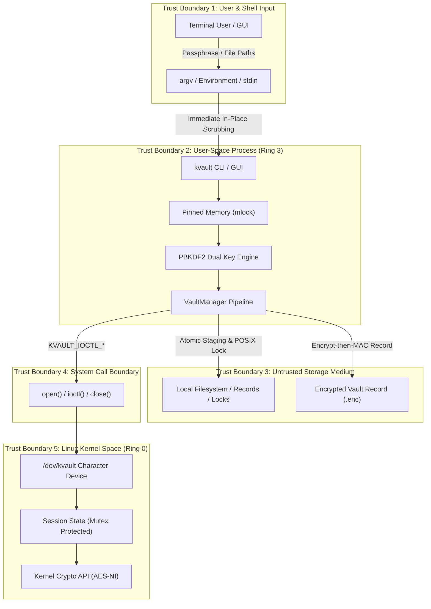

# KernelVault Threat Model & STRIDE Security Analysis

This document outlines the formal security architecture, trust boundaries, threat modeling (via the Microsoft STRIDE methodology), and defensive mitigations implemented in **KernelVault**.

---

## 1. Asset Inventory & Classification

| Asset | Sensitivity | Location | Protection Mechanism |
| :--- | :--- | :--- | :--- |
| **Plaintext File Data** | **High** (Confidentiality) | Disk / Staged memory | AES-256-CBC, atomic zeroization, secure multi-pass shredding |
| **Master Passphrase** | **Critical** (Root of Trust) | Transient RAM only | Interactive masked input, in-place `argv` scrubbing, `secureZero` |
| **Derived Keys ($K_{\text{enc}}, K_{\text{mac}}$)** | **Critical** (Cryptographic) | Process RAM / Kernel RAM | `PinnedMemory<32>` (`mlock`), `memzero_explicit`, `FLUSH_KEY` ioctl |
| **Integrity Tags (HMAC)** | **High** (Authenticity) | 96-byte `VaultHeader` | HMAC-SHA256, constant-time verification |
| **Directory Structure** | **Medium** (Metadata) | Encrypted archive payload | `KVDIR1` binary format inside AES ciphertext |
| **POSIX Attributes** | **Medium** (Permissions) | 96-byte `VaultHeader` | Little-Endian authenticated wire format |

---

## 2. Trust Boundaries & Architecture Diagram

---

## 3. STRIDE Threat Analysis & Defensive Mitigations

### 3.1. Spoofing (Identity & Authenticity)
* **Threat:** An adversary crafts a forged `.enc` vault record or replaces an existing record with their own ciphertext.
* **Mitigation:**
  - **Encrypt-then-MAC Authentication:** Every vault record is authenticated with a 256-bit HMAC-SHA256 tag derived from a separate key ($K_{\text{mac}}$) via RFC 2898 multi-block PBKDF2.
  - **Authenticated Header:** The entire 96-byte `VaultHeader` is included in the HMAC verification digest. A forged header or modified parameters (e.g. altered payload lengths) fail MAC verification immediately.
  - Decryption never begins until HMAC verification succeeds in $O(1)$ memory.

### 3.2. Tampering (Integrity Violations)
* **Threat 1 (Ciphertext Bit-Flipping):** Under AES-CBC mode, modifying byte $C_{i}$ causes predictable bit-flips in decrypted plaintext $P_{i+1}$.
  - *Mitigation:* The HMAC tag protects against any flipped bits in the ciphertext stream. Tampered ciphertext is rejected prior to CBC block decryption.
* **Threat 2 (Zip-Slip / Tar-Slip Path Traversal):** Malicious directory archives containing `../../etc/passwd` or `/root/.ssh` overwrite system files upon decompression.
  - *Mitigation:* `VaultManager::decryptDirectory` enforces strict lexical path sanitization:
    1. Leading forward slashes (`/`) and root indicators are rejected.
    2. Any path element containing `..` or empty components throws a fatal security exception.
    3. Destination paths are resolved relative to the target directory and asserted to stay within bounds.
* **Threat 3 (Concurrent Writer Race):** Two processes encrypting or modifying the same record simultaneously corrupt the record file.
  - *Mitigation:* Non-blocking POSIX advisory write locks (`fcntl(F_SETLK)`) on dedicated lockfiles (`locks/<name>.lock`) ensure mutual exclusion.

### 3.3. Repudiation
* **Threat:** Uncontrolled modification or deletion of vault records without concurrency arbitration.
* **Mitigation:**
  - Stale lock garbage collection validates active PID existence (`kill(pid, 0) == 0`) before cleaning abandoned locks.
  - Safe record deletion (`kvault rm`) requires exclusive advisory lock acquisition before unlinking.

### 3.4. Information Disclosure (Confidentiality)
* **Threat 1 (Process Memory Inspection via `/proc`):** Passphrases passed via command-line flags (`--key`) visible in `ps aux` or `/proc/<pid>/cmdline`.
  - *Mitigation:* The CLI parses `argv[i]` and immediately performs in-place zeroization with `memset(argv[i], 'x', strlen(argv[i]))`.
* **Threat 2 (RAM Swapping to Disk):** Plaintext keys swapped into unencrypted Linux swap partitions during system memory pressure.
  - *Mitigation:* Keys are managed in `PinnedMemory<32>`, which invokes `mlock(2)` to pin pages in physical DRAM, preventing swap eviction.
* **Threat 3 (Compiler Dead-Store Elimination):** Optimizing compilers deleting `memset()` calls for variables about to leave scope.
  - *Mitigation:* Zeroization is executed through `KeyDerivation::secureZero()` using a volatile memory pointer barrier (`asm volatile("" : : "r"(p) : "memory")`), preventing dead-store elimination. In kernel space, `memzero_explicit()` is used.
* **Threat 4 (Timing Side-Channels):** Variable-time `memcmp()` revealing HMAC tag bytes through timing discrepancies.
  - *Mitigation:* Constant-time verification (`KeyDerivation::verifyHmacConstantTime`) compares all 32 bytes using bitwise OR accumulation without early exits.
* **Threat 5 (Forensic Recovery of Deleted Source Files):** Plaintext files unlinked via standard `unlink()` leave raw blocks intact on disk blocks.
  - *Mitigation:* `kvault shred` executes multi-pass secure wiping using CSPRNG entropy (`getrandom`), followed by zero-fill, metadata zeroing, and `fsync()`.

### 3.5. Denial of Service (Availability)
* **Threat 1 (Unbounded RAM Allocation):** Processing multi-gigabyte vault records causing process exhaustion (OOM Killer).
  - *Mitigation:* The streaming pipeline operates in fixed 64 KiB chunks ($O(1)$ memory consumption), independent of file size.
* **Threat 2 (Kernel Session Exhaustion):** Opening multiple file descriptors without closing, exhausting driver resources.
  - *Mitigation:* Dynamic session allocation with per-session mutexes and RAII `UniqueFd` wrappers guaranteeing clean closure and memory zeroization upon destruction.

### 3.6. Elevation of Privilege
* **Threat 1 (Kernel Memory Corruption):** Malicious user-space pointers causing kernel memory writes or kernel panics.
  - *Mitigation:* All IOCTL parameters are validated in `driver/kvault_module.c`. Buffer transfers use `copy_from_user` and `copy_to_user` exclusively. Lengths are strictly bound to multiples of AES block size (16 bytes) up to a max chunk barrier (1 MiB).
* **Threat 2 (Symlink Hijacking):** Attackers pre-creating symlinks pointing to `/etc/shadow` in `records/` or `locks/`.
  - *Mitigation:* File operations use `O_NOFOLLOW` and `O_CREAT | O_EXCL` flags, rejecting symlinks and preventing arbitrary file overwrites.

---

## 4. Residual Risks & Operational Assumptions

1. **Host Integrity (Ring 0 / Root Compromise):** If an adversary has root access to the host machine or controls the kernel, they can inspect process memory via `ptrace` or load arbitrary kernel modules. KernelVault assumes a trusted OS kernel.
2. **Flash Storage Wear-Leveling:** On SSDs with aggressive wear-leveling controllers, file shredding overwrites new physical flash blocks while old blocks remain until garbage collected by the SSD controller. Users are advised to combine KernelVault with full-disk encryption (LUKS) on solid-state media.
